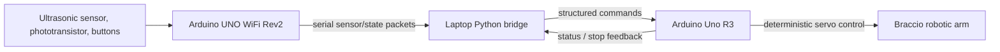

# System Architecture

## Purpose
This document defines the current technical boundaries of Eco Sort Robotics. The system is intentionally distributed so sensor logic, communication, and real-time actuation remain separate and testable.

## Architecture Summary
The current architecture is a three-node pipeline: the Arduino UNO WiFi Rev2 owns sensing and local state logic, the laptop running Python owns message routing and future AI, and the Arduino Uno R3 owns deterministic servo control for the Braccio arm. The boards do not bypass one another, and the WiFi Rev2 does not directly drive servos.

## Control Boundaries
- Arduino UNO WiFi Rev2 reads sensors, runs the local state machine, and emits structured messages
- Python validates, logs, and routes messages between boards, and later will host higher-level AI or policy logic
- Arduino Uno R3 receives only structured commands and performs real-time actuator control
- Emergency stop behavior remains on the actuator side so the system can fail safe even if the laptop bridge is unavailable

## Arduino Hardware Layer
- Arduino Braccio robotic arm provides the motion platform
- Arduino Uno R3 executes the control contract for servo movement
- Arduino UNO WiFi Rev2 handles sensor input and logic separation
- Arduino Education Shield reduces wiring friction during prototyping
- Breadboards, buttons, LEDs, buzzer, potentiometer, and wiring provide the current bench setup

## Sensor and State Layer
- Phototransistor for experimental sensing and threshold work
- Arcade buttons for manual state control and safety interactions
- LEDs for immediate machine-state feedback
- Piezo buzzer for audio alerts
- Ultrasonic sensor for the next sensing stage and obstacle awareness

## Communication Flow
1. Sensors are sampled on the UNO WiFi Rev2
2. The Rev2 formats a newline-delimited message and sends it to Python
3. Python parses the message, applies routing or future AI logic, and forwards commands to the Uno R3
4. The Uno R3 executes deterministic Braccio movements or stops safely
5. Status and error messages travel back through Python for logging and debugging

## Interface Contracts
- Sensor messages use key=value fields and explicit message types
- Command messages contain a single action and optional reason or sequence id
- Error messages are explicit and machine-readable
- STOP has priority over all motion commands

## Future Modular Architecture
The next architecture step is to keep the protocol stable while adding additional sensing, classification, and monitoring. This allows the project to scale without turning any single firmware file into a monolithic controller.

Planned modules include:
- Motion and state control on Uno R3
- Proximity and safety sensing on WiFi Rev2
- Serial communication bridge on Python
- Vision and classification on Python
- Operator dashboard and metrics

## Architecture Decisions Log
- Keep safety logic local to the embedded control layer
- Treat AI as a future decision-support layer, not a substitute for safety checks
- Use the laptop bridge as the only board-to-board communication path
- Prefer simple, observable interfaces over hidden automation
